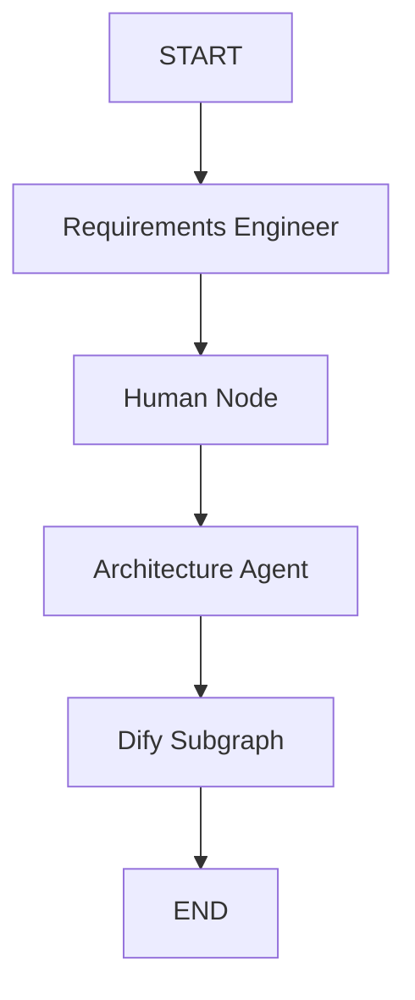
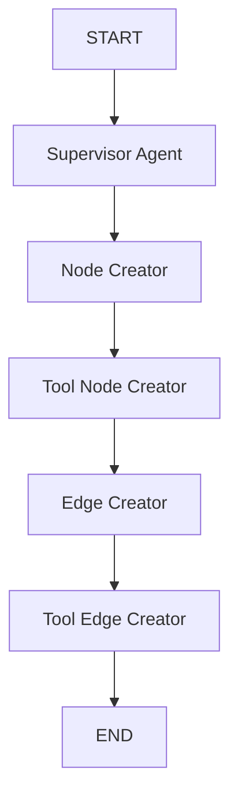

# Documentação do Sistema de Construção de Grafos Multiagentes

## Visão Geral
Este sistema implementa um framework para construção de sistemas multiagentes utilizando `langgraph`. Ele define agentes responsáveis por diferentes estágios do processo, desde a coleta de requisitos até a geração de nós e arestas no framework Dify por exemplo.

#### Fluxos de execução
##### Grafo Principal

##### Subgrafo Secundario Dify

## Estrutura do Código
O código é organizado nos seguintes módulos:
- **`state`**: Define os estados `AgentState` e `DifyState`.
- **`agents`**: Contém os agentes que executam diferentes tarefas na construção do grafo.
- **`tools`**: Fornece funções para criação de nós e arestas no YAML.

## Fluxo de Execução
1. O `main` inicializa o sistema, solicita a entrada do usuário e inicia o grafo.
2. O grafo é construído em `build_graph()`, definindo os nós e arestas.
3. O grafo principal inicia com o `requirements_engineer`, que coleta os requisitos do sistema.
4. O `architecture_agent` processa os requisitos e gera a arquitetura do sistema multiagente.
5. O `supervisor_agent` coordena a criação dos nós e arestas para o framework Dify.
6. Os agentes `node_creator` e `edge_creator` preenchem o YAML correspondente.
7. O fluxo se repete até que o usuário esteja satisfeito com a definição da arquitetura.

## Componentes Principais
### 1. `build_graph()`
Cria e configura o grafo de estados, incluindo os subgrafos para geração dos nós e arestas.

### 2. `main()`
- Solicita entrada do usuário.
- Inicia o grafo e gerencia a comunicação entre agentes.
- Exibe os resultados e permite interações iterativas.

### 3. Agentes Definidos
#### `requirements_engineer`
- Coleta e refina os requisitos do sistema multiagente.

#### `architecture_agent`
- Converte os requisitos em uma arquitetura estruturada.
- Identifica os agentes e suas interações.

#### `supervisor_agent`
- Coordena a criação de nós e arestas para o YAML do Dify.

#### `node_creator`
- Gera os nós YAML necessários para representar os agentes.

#### `edge_creator`
- Cria as conexões (arestas) entre os nós gerados.

## Exemplo de Uso
1. O usuário insere uma descrição inicial do sistema.
2. O `requirements_engineer` faz perguntas para detalhar os requisitos.
3. O `architecture_agent` gera a arquitetura.
4. O `supervisor_agent` inicia a criação dos nós e arestas no YAML.
5. O `node_creator` e `edge_creator` preenchem o arquivo YAML.
6. O usuário pode iterar até estar satisfeito com a arquitetura gerada.

## Conclusão
Este sistema automatiza a criação de arquiteturas multiagentes e sua integração com o Dify, garantindo uma definição clara e estruturada antes da implementação final.