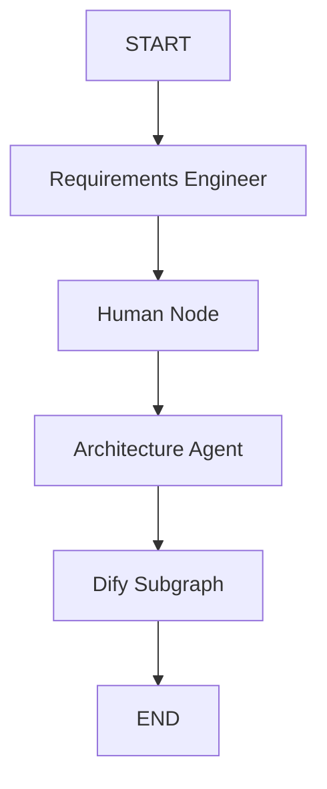
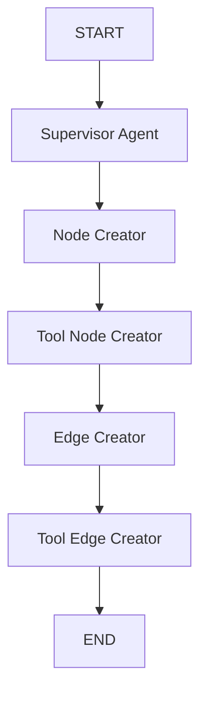

# Graph Builder Module

## Visão Geral
O arquivo 'main.py' é o Módulo principal que constrói e executa o grafo de agentes para geração de aplicações. Implementa um fluxo de trabalho multiagente usando LangGraph e permite a interação com o humano.

#### Fluxos de execução
##### Fluxo Principal

##### Fluxo Secundario do Dify

